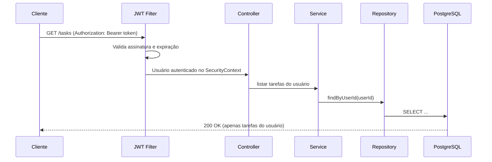

# 🚀 TaskFlow API


API RESTful para gerenciamento de tarefas com **autenticação stateless via JWT** e **isolamento de dados por usuário**. O projeto foi construído como um laboratório prático para consolidar **Spring Boot, Spring Security, Docker, arquitetura em camadas e Design Patterns**.

---

## 📑 Sumário

- [Visão Geral](#-visão-geral)
- [Stack](#️-stack)
- [Requisitos Funcionais](#-requisitos-funcionais)
- [Arquitetura](#️-arquitetura)
- [Como Executar](#️-como-executar)
- [Variáveis de Ambiente](#-variáveis-de-ambiente)
- [Endpoints](#-endpoints)
- [Exemplos de Uso](#-exemplos-de-uso-curl)
- [Segurança](#️-segurança)
- [Decisões Técnicas](#-decisões-técnicas)
- [Roadmap](#-roadmap)
- [Autor](#-autor)

---

## 🎯 Visão Geral

O fluxo da aplicação é simples:

1. O usuário se **registra** e faz **login** em rotas públicas.
2. O login retorna um **token JWT**.
3. Todas as rotas de `/tasks` exigem esse token e operam **apenas sobre as tarefas do usuário autenticado**.

---

## 🛠️ Stack

| Camada | Tecnologias |
|---|---|
| Linguagem / Framework | Java 17+, Spring Boot |
| Persistência | Spring Data JPA, Hibernate, PostgreSQL |
| Segurança | Spring Security, JWT, CORS |
| Infraestrutura | Docker, Docker Compose |
| Build | Apache Maven |

---

## 📋 Requisitos Funcionais

- **Autenticação:** cadastro de usuários e login com emissão de token JWT.
- **CRUD de tarefas:** criar, listar, atualizar e remover tarefas.
- **Isolamento de dados:** cada usuário enxerga e manipula somente as próprias tarefas.
- **Segurança de rotas:** rotas de autenticação públicas; rotas de tarefas protegidas por token.

---

## 🏗️ Arquitetura

### Fluxo de uma requisição autenticada



### Organização em camadas

```
controller  →  recebe/valida requisições e devolve DTOs
service     →  regras de negócio e isolamento por usuário
repository  →  acesso a dados (Spring Data JPA)
security    →  filtro JWT, configuração de rotas e CORS
dto         →  contratos de entrada e saída da API
entity      →  modelos persistidos no banco
```

### Padrões aplicados

- **DTO (Data Transfer Object):** desacopla as entidades do banco dos contratos expostos pela API, evitando vazamento de campos internos (ex.: senha).
- **Builder Pattern:** construção fluida e legível de entidades e DTOs.
- **Arquitetura em camadas:** separação clara de responsabilidades entre Controller, Service e Repository.
- **Containerização:** aplicação e banco rodando em uma rede Docker interna orquestrada pelo Docker Compose.

---

## ⚙️ Como Executar

### Pré-requisitos

- [Docker](https://www.docker.com/) e Docker Compose
- *(Opcional, para rodar sem Docker)* [Java 17+](https://adoptium.net/) e [Maven](https://maven.apache.org/)

### Com Docker (recomendado)

```bash
# 1. Clone o repositório
git clone https://github.com/seu-usuario/taskflow-api.git
cd taskflow-api

# 2. Suba a aplicação e o banco
docker compose up --build
```

A API ficará disponível em **http://localhost:8080**.

Para parar e remover os containers:

```bash
docker compose down
```

### Sem Docker (local)

Com um PostgreSQL rodando e as [variáveis de ambiente](#-variáveis-de-ambiente) configuradas:

```bash
./mvnw spring-boot:run
```

---

## 🔧 Variáveis de Ambiente

> Ajuste os nomes conforme o seu `application.yml` / `docker-compose.yml`.

| Variável | Descrição | Exemplo |
|---|---|---|
| `SPRING_DATASOURCE_URL` | URL de conexão com o PostgreSQL | `jdbc:postgresql://db:5432/taskflow` |
| `SPRING_DATASOURCE_USERNAME` | Usuário do banco | `taskflow` |
| `SPRING_DATASOURCE_PASSWORD` | Senha do banco | `********` |
| `JWT_SECRET` | Chave usada para assinar os tokens | `********` (use um valor longo e aleatório) |
| `JWT_EXPIRATION` | Tempo de expiração do token (ms) | `86400000` |

---

## 🔌 Endpoints

### Autenticação (público)

| Método | Rota | Descrição |
|---|---|---|
| `POST` | `/auth/register` | Cadastra um novo usuário |
| `POST` | `/auth/login` | Autentica e retorna o token JWT |

### Tarefas (protegido)

Exige o header `Authorization: Bearer <token>`.

| Método | Rota | Descrição |
|---|---|---|
| `GET` | `/tasks` | Lista as tarefas do usuário autenticado |
| `POST` | `/tasks` | Cria uma nova tarefa |
| `PUT` | `/tasks/{id}` | Atualiza uma tarefa existente |
| `DELETE` | `/tasks/{id}` | Remove uma tarefa |

### Códigos de status

| Código | Quando ocorre |
|---|---|
| `200 OK` | Requisição bem-sucedida |
| `201 Created` | Recurso criado |
| `204 No Content` | Remoção bem-sucedida |
| `400 Bad Request` | Payload inválido |
| `401 Unauthorized` | Token ausente, inválido ou expirado |
| `403 Forbidden` | Tentativa de acessar recurso de outro usuário |
| `404 Not Found` | Recurso não encontrado |

---

## 💻 Exemplos de Uso (cURL)

**1. Registrar usuário**

```bash
curl -X POST http://localhost:8080/auth/register \
  -H "Content-Type: application/json" \
  -d '{"name": "Seu Nome", "email": "email@email.com", "password": "SenhaForte@123"}'
```

**2. Fazer login**

```bash
curl -X POST http://localhost:8080/auth/login \
  -H "Content-Type: application/json" \
  -d '{"email": "email@email.com", "password": "SenhaForte@123"}'
```

Resposta:

```json
{
  "token": "eyJhbGciOiJIUzI1Ni..."
}
```

**3. Criar uma tarefa**

```bash
curl -X POST http://localhost:8080/tasks \
  -H "Authorization: Bearer <token>" \
  -H "Content-Type: application/json" \
  -d '{"title": "Estudar Spring", "description": "Finalizar módulo de segurança", "dueDate": "2026-12-31"}'
```

**4. Listar tarefas**

```bash
curl http://localhost:8080/tasks \
  -H "Authorization: Bearer <token>"
```

---

## 🛡️ Segurança

- **Autenticação stateless:** nenhuma sessão é mantida no servidor; cada requisição carrega seu próprio token JWT.
- **Hash de senhas:** as senhas são armazenadas com hash (BCrypt), nunca em texto puro.
- **Autorização por propriedade:** o serviço sempre filtra as tarefas pelo usuário do token, impedindo acesso a dados de terceiros.
- **CORS:** configurado no Spring Security para permitir o consumo por diferentes origens de front-end (ex.: React ou Angular em portas locais distintas).
- **Segredos fora do código:** chave JWT e credenciais do banco são injetadas por variáveis de ambiente.

---

## 🧠 Decisões Técnicas

- **JWT em vez de sessão:** simplifica a escalabilidade horizontal, já que a API não depende de estado no servidor.
- **DTOs em vez de expor entidades:** protege o modelo de dados e permite evoluir a API sem quebrar o contrato.
- **PostgreSQL via Docker Compose:** garante ambiente reproduzível, com um único comando para subir tudo.

---

## 🗺️ Roadmap

- [ ] Testes unitários (JUnit/Mockito) e de integração (Testcontainers)
- [ ] Documentação interativa com Swagger / OpenAPI
- [ ] Paginação e filtros na listagem de tarefas
- [ ] Status e prioridade nas tarefas
- [ ] Refresh token
- [ ] Pipeline de CI com GitHub Actions
- [ ] Gerenciamento de equipes (compartilhamento de tarefas)

---

## 👨‍💻 Autor

**Seu Nome**
Desenvolvedor Backend

[LinkedIn](https://linkedin.com/in/seu-perfil) · [GitHub](https://github.com/seu-usuario) · seu@email.com
